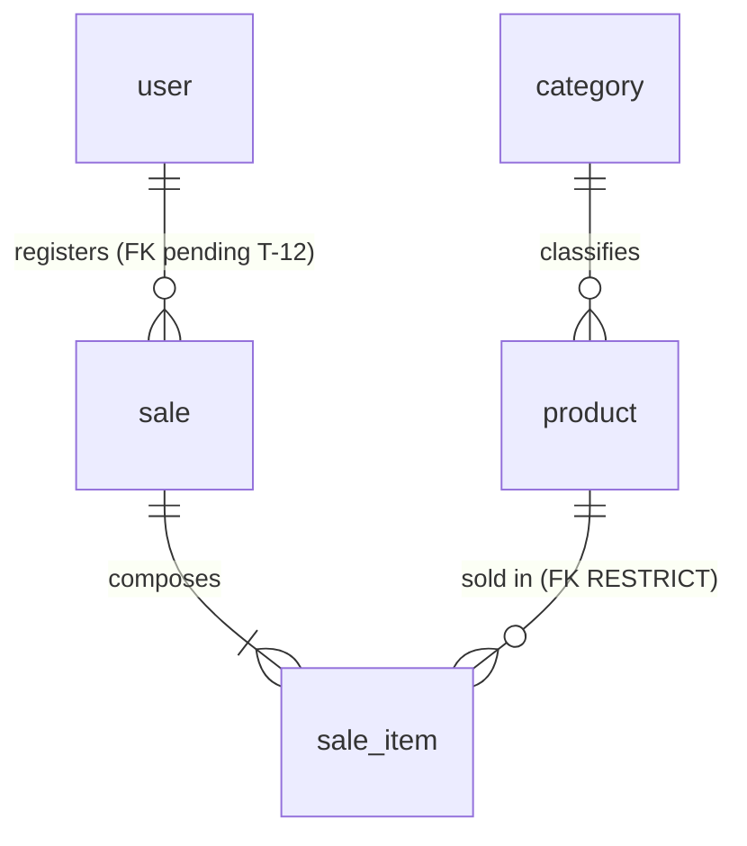

# Data model — Simple Stock Flow

**The only place where the data model lives.** Whoever implements it does not need to open the code or
connect to the engine to know what exists, of what type, under what rule, and **where that rule lives today**.

- **Date:** 2026-09-19
- **Verified against:** PostgreSQL 16.14 (`simple-stock-flow-db-1`), database `simple_stock_flow`, schema
  `sales`, server in UTC. The queries and their literal output are in [§10](#10-how-to-check-that-this-document-does-not-lie).
- **Governed by:** [`constitution.md`](constitution.md) (non-negotiable) and [`spec.md`](spec.md) (what and
  why). The technical decisions D-01…D-10 are in [`plan.md`](plan.md) §1; the shape of the
  system, in [`architecture.md`](architecture.md); the four structural decisions, in
  [`adr/`](adr/).
- **`plan.md` no longer describes the schema.** Its §2 and §3 link here. If anything there contradicts
  this document, this document wins; if this document contradicts the engine, **the engine wins**
  (Article X) and the document is broken.

---

## How to read this document

Every rule of the model carries a mark, and **there are only three**:

| Mark | Means |
|---|---|
| **engine** | Exists in Postgres right now. A manual `INSERT` respects it or fails |
| **domain-only** | Guaranteed by C# and nothing else. **An `INSERT` through `psql` skips it silently** |
| **pending (T-xx)** | Does not exist yet. That task in [`tasks.md`](tasks.md) adds it |

**Why the third column is the heart of the document.** An invariant that lives only in C#
protects the application, not the data: any `psql`, any migration and any future service
skips it without noticing. [ADR-002](adr/adr-002-concurrencia-optimista.md) already set the criterion
for `stock >= 0` —*if the constraint fires, something wrote outside the adapter*— and that criterion holds
for **every** invariant that can be expressed in the engine. What is not enforced is declared
pending; it is not promised.

---

## 0. Schema naming convention

**All five tables are singular.** The governance convention table requires it, and the
project aligns with it:

| Element | Convention | Example |
|---|---|---|
| Entity | `PascalCase`, English, **singular**, ASCII | `SaleItem` |
| Attribute | `snake_case`, English, **singular**, ASCII | `unit_price` |
| List attribute | **Never plural** | `sale_item`, not `sale_items` |

The translation to schema is direct: `category`, `product`, `sale`, `sale_item`, `user`. **What
becomes singular is the table; the schema is still called `sales`**, so the qualified form of the
sales aggregate is `sales.sale`.

**The singular does not reach the object code, and that is not an exception but the boundary.** The
names of the domain classes (`Product`, `Sale`, `SaleItem`, `User`, `Category`) were already singular and
correct; the C# collections (`Sale.Items`, `DbSet<Product> Products`) **stay plural**
because they name sets of objects, not tables. Translating from one to the other is the responsibility of the
persistence adapter, which is exactly where the mapping lives.

**`user` does not require quoting, and this is verified.** Postgres treats `user` as a keyword
**only when unqualified**; as soon as the name has a schema in front, it reads it as an identifier:

```sql
create table sales."user"(id int);
select * from sales.user;   -- works, WITHOUT quotes
```

Every query in this project is preceded by `sales.`, so the problem does not arise
—and EF quotes it on its own anyway—. **The reason is that the schema qualifies, not that
the name is plural**: any document that gives the other reason is wrong, even if it gets
the conclusion right.

**Writing and seeing are not the same thing, and they should not be confused.** Postgres **does not require** quotes
when writing, but it **does print** them when it renders the identifier on its own: in §10.2 and §10.3
the table appears as `sales."user"`, not as `sales.user`. It is catalog cosmetics, not a
syntax obligation, and there is no query in this project that has to quote it.

> The other axis of the convention —which names EF generates and which are written by hand— is in
> [§3.1](#31-naming-convention--two-styles-coexist-today).

---

## 1. Domain glossary

In business language. The code and the column names are in English (Article XI); the technical column
indicates where each term lives.

| Term (business) | Functional definition | Where it lives (technical) |
|---|---|---|
| **Product** | Catalog item. It has **a name, price, stock, category and optional image, and nothing else** (DP-03) | `Product` · table `product` |
| **Category** | Classification a product belongs to. **Fixed set of five**, seeded, with no maintenance (D-10) | `Category` · table `category` |
| **Price** | Current monetary value of the product in the catalog. Strictly positive | `Money` (value object) · column `product.price` |
| **Stock** | Available units of the product. Never negative | `product.stock` |
| **Product image** | **Opaque key** of the binary in external storage. Neither the binary nor a path (D-08). Absent is represented by `NULL`, never by an empty string | `product.image_key` |
| **Sale** | Consummated and **immutable** commercial fact: who, when and what. Once registered it is neither edited nor deleted | `Sale` · table `sale` |
| **Sale line** | Row of the sale: product, quantity and **frozen price** of the moment. It does not exist outside its sale | `SaleItem` · table `sale_item` |
| **Quantity** | Units sold in a line. Strictly positive | `Quantity` (value object) · `sale_item.quantity` |
| **Sale total** | Sum of subtotals. **It is calculated, not stored** (Article VII) | `Sale.Total` · **no column** |
| **Line subtotal** | Unit price times quantity. **It is calculated, not stored** | `SaleItem.Subtotal` · **no column** |
| **User** | Internal operator who authenticates and registers sales. **There is no customer or buyer entity** | `User` · table `user` |
| **Role** | The user's attribution within a closed set of two: `admin` or `seller` | `user.role` |
| **Password hash** | Irreversible fingerprint of the password. The domain **never sees the plain-text password** (D-09) | `user.password_hash` |
| **Date range** | Time window of the report. The end cannot be earlier than the start | Application-layer value object · **no table** |
| **Sales report** | Aggregation by product over a range. **It is not persisted**: it is calculated in the engine through a read port (D-06) | Read model · **no table** |

**Frozen name.** When this document says a value is *frozen*, it means that the sale
line stores a **copy of the value at the instant of the sale** and that copy does not follow
the catalog. It is not denormalization: the sale price and the sold name are **facts of the sale itself**,
not product attributes read late. It is what allows renaming or repricing a
product without rewriting reports of closed periods.

**Adapted from the recovered one, with two corrections.** The glossary of the recovered document
`data/data-model.md` §2 included *sale currency* as a term; **the system is single-currency by
construction** (D-05) and there is no currency column in any table. And its definition of Product
left the door open to additional attributes; **DP-03 closes it**: name, price, stock,
category and image. No description, no SKU, no reference code.

---

## 2. The five entities and their invariants

**Five entities, five tables, no surplus.** There is no report table, nor audit table, nor counter
table, nor tables for the value objects —which have no identity and live inside the row
of their owner (D-07)—.



### 2.1 `Category` — reference entity

| Invariant | Who enforces it | Mark |
|---|---|---|
| Name required and non-empty; stored trimmed | `Category.Rename` | **domain-only** · moves down to the engine in T-20 |
| Unique name | Unique index `IX_category_name` | **engine** |

**It is not an aggregate root and has no lifecycle.** Its repository is **read-only**: no
port creates, renames or deletes categories. The five rows are born in the initial migration ([§9](#9-seed-strategy)).

### 2.2 `Product` — aggregate root (catalog)

| Invariant | Who enforces it | Mark |
|---|---|---|
| Name required and non-empty; stored trimmed | `Product.Rename` | **domain-only** (`NOT NULL` is in the engine; *non-empty* is not) |
| `price > 0` | `Product.ChangePrice` | **domain-only** · T-20 |
| `stock >= 0` after any operation | `Product.Withdraw` / `Product.Restock` | **engine** — `ck_product_stock_non_negative`, the last barrier of ADR-002 |
| Withdrawing more stock than available fails | `Product.Withdraw` | **domain-only** — it is a process rule, not expressible in a `CHECK` |
| Category required and existing | `Product.SetCategory` + `FK_product_category_category_id` | **engine** |
| `image_key` absent ⇒ `NULL`, never an empty string | `Product.AttachImage` normalizes blank to `null` | **domain-only** · there is *no* equivalent pending rule: `NULL` is the only representation and `image_key IS NULL` suffices |
| Never physically deleted: soft delete | Shadow property `deleted_at` + global filter | **engine** since T-09 · the column exists and the global filter applies it — see [ADR-003](adr/adr-003-baja-logica.md) |

**`Money` admits a zero amount and this matters.** Its constructor rejects only negatives, so
`new Money(0)` is valid. The only guard for `price > 0` is `Product.ChangePrice`: a product with
price 0 inserted through `psql` passes today. It is exactly the gap that the `CHECK` of T-20 closes.

**The rounding rule lives in `Money`, not in the column.** `Money` rounds to **2 decimals with
`MidpointRounding.AwayFromZero`** before storing; the column is `numeric(18,2)`. They coincide by
construction, not by chance. **If one changes, the other changes in the same migration**: with more
decimals in the column the extra precision would always be zero, and with more decimals in `Money` the
engine would trim on its own and the amount read would no longer be the amount written.

### 2.3 `Sale` — aggregate root (sales)

| Invariant | Who enforces it | Mark |
|---|---|---|
| Records who performs it; required and non-empty | `Sale` constructor | **domain-only** (`NOT NULL` is in the engine) |
| **At least one line** to be confirmable | `Sale.EnsureConfirmable` | **domain-only** — not expressible in a `CHECK`; it would require a deferred trigger |
| **A product is not repeated** within the same sale | `Sale.AddItem` rejects the duplicate | **domain-only** *and now also* **engine**: the unique index `(sale_id, product_id)` exists since T-20, with `INCLUDE (quantity, unit_price)` |
| Withdrawing stock and adding the line are **a single operation** | `Sale.AddItem` calls `Product.Withdraw` before adding | **domain-only** — it is the rule that gives the aggregate its meaning |
| Immutable once registered | There is no edit or delete port | **domain-only** (by absence of an operation) |

**The sale does not know the currency.** The total is calculated by adding subtotals and `Money` requires the same
currency when adding; since the mapping always rebuilds the default currency, today it cannot fail. **The
explicit guard in `Sale.AddItem` is cheap debt and has a task: T-05.**

### 2.4 `SaleItem` — internal entity of the `Sale` aggregate

| Invariant | Who enforces it | Mark |
|---|---|---|
| Product required | `SaleItem` constructor + `NOT NULL` | **engine** · `NOT NULL` and the **FK** `FK_sale_item_product_product_id` with `RESTRICT`, added by T-20 |
| `quantity > 0` | `Quantity` constructor | **domain-only** · T-20 |
| Name and price **frozen** at the instant of the sale | `Sale.AddItem` copies from `Product` | **domain-only**, by construction |
| **Category** name **frozen** | `SaleItem` constructor + `NOT NULL` | **engine** (T-11) · `sale_item.category_name`, with no foreign key on purpose — D-06 and [ADR-004](adr/adr-004-reporte-agregado-y-congelado.md) |
| **It does not exist outside its sale** | `FK_sale_item_sale_sale_id ON DELETE CASCADE` | **engine** entirely: the cascade and the `sale_id NOT NULL` that completes it, added by T-20 |

**It is not built from outside.** Its constructor is `internal` and only `Sale.AddItem` invokes it: there
is no legitimate way to fabricate a loose line.

### 2.5 `User` — aggregate root (identity)

| Invariant | Who enforces it | Mark |
|---|---|---|
| Username required and **unique** | Constructor + unique index `IX_user_username` | **engine** (uniqueness) |
| Username **lowercase and trimmed** | `User.NormalizeUsername` | **domain-only** · T-20 |
| Password hash required and non-empty | `User` constructor | **domain-only** (`NOT NULL` is in the engine) |
| `role` in `('admin','seller')` | `Roles.IsValid` | **domain-only** · T-20 |
| The domain **never sees the plain-text password** | The hash is produced by a port (D-09) | By design of the hexagon |

**Why normalization is an invariant and not a convenience.** A lookup that skipped
`NormalizeUsername` would allow registering `"Ana "` as a new account that **could never log
in**: the aggregate would store it as `ana` and it would collide with the existing one.

---

## 3. Physical model — the 22 columns

Schema `sales` of the database `simple_stock_flow`. **No column has a `DEFAULT`, and that is deliberate: the
values are set by the domain**, never by the engine —an engine default would be a second source of
truth that nobody tests—. The types are those that `information_schema.columns` returns today; the literal
output is in [§10](#10-how-to-check-that-this-document-does-not-lie).

**Tables in singular, without exception**, according to the convention in
[§0](#0-schema-naming-convention). The why and the verification of `user` are there; they are not repeated here.

**`category`** — read-only seed data (D-10).

| Column | Type | Nullable | Default | Note |
|---|---|---|---|---|
| `id` | `uuid` | no | none | Primary key. Literal identifiers in the migration, so tests can reference them ([§9](#9-seed-strategy)) |
| `name` | `varchar(120)` | no | none | Unique |

**`product`**

| Column | Type | Nullable | Default | Note |
|---|---|---|---|---|
| `id` | `uuid` | no | none | Primary key |
| `name` | `varchar(200)` | no | none | The domain trims it before storing |
| `price` | `numeric(18,2)` | no | none | Only the amount: **no currency column** (D-05). 16 integer digits, more than enough for the scope |
| `stock` | `integer` | no | none | |
| `category_id` | `uuid` | no | none | Restrictive foreign key to `category` — [§5](#5-foreign-key-policy) FK-1 |
| `image_key` | `varchar(512)` | **yes** | none | Opaque key, never a path or bytes (D-08) |
| `category_name` | `varchar(120)` | no | none | **engine** (T-11) · the label frozen at the instant of the sale. **No foreign key on purpose**: if it had one, renaming the category would rewrite the history, which is exactly what ADR-004 prohibits. Same width as `category.name`, and **the two move together** |
| `deleted_at` | `timestamptz` | yes | none | **engine** (T-09, verified against `information_schema`: nullable, no default) · shadow property, with no property on the aggregate (D-03). Null while the product is active: this way it serves as a predicate for partial indexes |
| `xmin` | `xid` | — | — | **System column of the engine**, not of the schema. Postgres increments it on every `UPDATE`. It is the concurrency witness of D-04, exposed as a shadow property (T-10). **It does not appear in `information_schema` because it is not a declared column**, so it does not count among the 21 |

**`sale`** — the `sales` schema groups the entire system; the `sale` table names the aggregate. **The
singular undoes the collision that existed**: until the renaming there was a `sales` table inside the
`sales` schema and the qualification was `sales.sales`. Today it is `sales.sale`, and the prefix does not change:
**what becomes singular is the table, never the schema**.

| Column | Type | Nullable | Default | Note |
|---|---|---|---|---|
| `id` | `uuid` | no | none | Primary key |
| `sold_at` | `timestamptz` | no | none | Instant of the sale. **It is the only business instant of the system** ([§8](#8-audit-created_at--updated_at)) |
| `sold_by` | `varchar(120)` | no | none | **It is called this today.** It is renamed to `sold_by_username` in **T-12** (see note below) |
| `sold_by_user_id` | `uuid` | no | none | **pending (T-12)** · restrictive foreign key to `user.id` — FK-4 |

**`sale_item`**

| Column | Type | Nullable | Default | Note |
|---|---|---|---|---|
| `id` | `uuid` | no | none | Primary key |
| `product_id` | `uuid` | no | none | **No foreign key today** — FK-3, [§5](#5-foreign-key-policy) |
| `product_name` | `varchar(200)` | no | none | Frozen copy of `product.name`, **same length on purpose** |
| `quantity` | `integer` | no | none | |
| `unit_price` | `numeric(18,2)` | no | none | Frozen copy of the price. **A single column**: no `unit_price_currency` (D-05) |
| `sale_id` | `uuid` | **yes — it is a defect** | none | Must become `NOT NULL`: a line without a sale means nothing, contradicts the cascade already configured and makes the unique composite useless. Cause: `HasForeignKey("sale_id")` creates a shadow property and EF makes it nullable if the relationship does not declare `IsRequired()` |
| `category_name` | `varchar(120)` | no | none | **pending (T-11)** · length equal to `category.name` because it is a frozen copy of that value (D-06). `NOT NULL` **is free today because the table is empty**; it stops being so with the first sale, and then the migration needs a backfill |

**`user`**

| Column | Type | Nullable | Default | Note |
|---|---|---|---|---|
| `id` | `uuid` | no | none | Primary key |
| `username` | `varchar(120)` | no | none | Unique. Stored lowercase and trimmed |
| `password_hash` | `varchar(512)` | no | none | **Never indexed** ([§7](#7-privacy-and-retention)) |
| `role` | `varchar(40)` | no | none | Closed set: `admin`, `seller` |

**Two cross-cutting rules, written so that nobody has to infer them.**

1. **No currency column in any table: the system is single-currency** (D-05). It is not reintroduced.
2. **All timestamps are `timestamptz`, without exception.** The server runs in UTC. Whoever
   adds a new date column does not have to deduce it from `sold_at`.

**About the two names of `sold_by`.** The column is called `sold_by` in the engine and `Sale.SoldBy` in
the domain. **The code is aligned with the long name and not the other way around**, because as soon as T-12 adds
`sold_by_user_id` next to it, a bare `sold_by` will not say which of the two it is. The renaming **does not touch the
API contract** —the field that travels is `SaleView.SoldBy` and does not change— and it is cheap now because
the table is empty.

### 3.1 Naming convention — two styles coexist today

What EF generates keeps its style: `PK_`, `IX_`, `FK_`, in `PascalCase` and quoted. What
is written by hand —which today is **only the `CHECK`s**— goes in `snake_case` with the pattern
`ck_{table}_{rule}`, like the `ck_product_stock_non_negative` that already exists. **Both conventions
are deliberate:** renaming what EF generates would force maintaining a parallel list of names in
every migration.

**Derived names follow the table.** When the tables moved to singular ([§0](#0-schema-naming-convention)),
EF regenerates its own —`PK_product`, `IX_category_name`, `FK_sale_item_sale_sale_id`— without anyone
writing them. **The only one that has to be renamed by hand is the `CHECK`**, precisely because EF does not
generate it: `ck_products_stock_non_negative` became `ck_product_stock_non_negative`. Leaving it with the
old name would have been the only object in the schema in plural.

### 3.2 Applied migrations

Four, not one. The schema is owned by the EF migrations and **nothing else** ([ADR-001](adr/adr-001-propiedad-del-esquema.md)).

| Migration | What it does | Task |
|---|---|---|
| `20260919175513_InitialSchema` | The five tables, the two foreign keys, the unique and access indexes, and **the five seed categories inside** | T-02 |
| `20260919194003_StockNonNegative` | The only `CHECK` of the schema | T-10 |
| `20260919203018_AccentSeedCategoryNames` | Fixes the accent of a seeded category: *Fontaneria* → *Fontanería* | T-02 |
| `20260919215344_RenameTablesToSingular` | The five tables become singular ([§0](#0-schema-naming-convention)). With them, the names that EF derives —primary keys, indexes and foreign keys— and, **by hand, the only `CHECK`**: `ck_products_stock_non_negative` → `ck_product_stock_non_negative`. **No column is renamed** | T-02 |

**The renaming is a migration and not a retouch of the document.** It goes the same way as all the DDL of
the system —ADR-001 admits no other— and it was applied with `product`, `sale` and `sale_item` **empty**,
`category` with 5 rows and `user` with 1: an instantaneous `ALTER TABLE ... RENAME TO`. With the first
real sale it would still be possible, but no longer free.

The history lives in `public."__EFMigrationsHistory"` —**outside the `sales` schema**, which is why
the column query returns 21 and not more—.

---

## 4. Constraints and indexes: where each rule lives

**Today the schema has eight constraints: five primary keys, two foreign keys and a single
`CHECK`.** The two uniquenesses (`category.name`, `user.username`) are enforced by the engine through a
**unique index**, not through a constraint, so they do not appear in `pg_constraint` but **they are
enforced**. Everything else is domain or is pending.

| Rule | Object in the engine | Where it lives today |
|---|---|---|
| Primary key of the 5 tables | `PK_category`, `PK_product`, `PK_sale`, `PK_sale_item`, `PK_user` | **engine** |
| `category.name` unique | `IX_category_name` (unique index) | **engine** |
| `user.username` unique | `IX_user_username` (unique index) | **engine** |
| `product.category_id` → `category.id`, `ON DELETE RESTRICT` | `FK_product_category_category_id` | **engine** |
| `sale_item.sale_id` → `sale.id`, `ON DELETE CASCADE` | `FK_sale_item_sale_sale_id` | **engine** |
| `product.stock >= 0` | `ck_product_stock_non_negative` | **engine** — the last barrier of ADR-002 |
| `product.price > 0` | — | **domain-only** · `Product.ChangePrice`. Moving it down to the engine is **T-20**. See `Money` in [§2.2](#22-product--aggregate-root-catalog) |
| `sale_item.quantity > 0` | — | **domain-only** · constructor of `Quantity`. Moving it down to the engine is **T-20** |
| `category.name` non-empty | — | **domain-only** · `Category.Rename`. Moving it down to the engine is **T-20** |
| `user.role` in `('admin','seller')` | — | **domain-only** · `Roles.IsValid`. Moving it down to the engine is **T-20** |
| `user.username` lowercase | — | **domain-only** · `User.NormalizeUsername`. Moving it down to the engine is **T-20** |
| `sale_item.sale_id NOT NULL` | `sale_item.sale_id` | **engine** (T-20) · it was the prerequisite of the unique composite, and that is why it went first |
| Unique `(sale_id, product_id)` | `IX_sale_item_sale_id_product_id` | **engine** (T-20) · **it cannot fulfill its function while `sale_id` admits nulls:** in a unique index each `NULL` is distinct from any other, so two lines with null `sale_id` and the same product coexist without complaint |
| `sale_item.product_id` → `product.id`, `ON DELETE RESTRICT` | `FK_sale_item_product_product_id` | **engine** (T-20) · **It is not a new decision: ADR-003 already relies on it** as a *last-resort barrier so that a manual delete fails loudly*. It was never implemented, and today `sale_item` has **no** foreign key toward the catalog |
| `sale.sold_by_user_id` → `user.id`, `ON DELETE RESTRICT` | — | **pending (T-12)** · the authorship of a sale cannot be left orphaned |
| Access indexes (`product`, `sale`, `sale_item`) | see [§6.2](#62-indexes-the-ones-that-exist-and-the-ones-that-are-missing) | Three exist, three are missing — **§6.2 separates them one by one** |

**Moving the five invariants marked *domain-only* down to the engine is the concrete debt of this
document, and it has a task: T-20.** It does not change a single line of domain: it is five `CHECK`s and an index.
What changes is that they stop depending on everyone going through the adapter.

### 4.1 Accents and case in `category.name`: uniqueness stays sensitive to both

*Fontanería* and *Fontaneria* are two valid rows, and *Pinturas* and *pinturas* as well. **This is accepted
knowingly and in writing, not by oversight:** the five categories are read-only seed data,
there is no category CRUD and no port creates them, so **nobody can cause the collision through
the interface**. The alternative —`citext`, or a unique index over `unaccent(lower(name))`— adds
an extension to the deployment to protect a table in which nobody writes.

**Explicit review condition: if category maintenance is ever opened, this
decision is reviewed before writing that CRUD.**

---

## 5. Foreign key policy

**Four relationships, four foreign keys planned. Today two exist.** This table is the complete policy:
the `ON DELETE` of each one, its `ON UPDATE`, and **why**.

| # | Foreign key | References | `ON DELETE` | `ON UPDATE` | Status | Why that action |
|---|---|---|---|---|---|---|
| **FK-1** | `product.category_id` | `category.id` | **`RESTRICT`** | `NO ACTION` | **engine** | A category with products is not deleted. Today it is theoretical —there is no category delete port— but **the restriction must exist before there is one**, not after |
| **FK-2** | `sale_item.sale_id` | `sale.id` | **`CASCADE`** | `NO ACTION` | **engine** | Pure composition: the line has no life outside its sale. **In practice it never fires**, because sales are not deleted ([§7.1](#71-retention)). It is there so that the model tells the truth about the nature of the relationship, not to be used |
| **FK-3** | `sale_item.product_id` | `product.id` | **`RESTRICT`** | `NO ACTION` | **engine** (T-20) | **Last-resort barrier.** A physical delete must never be able to orphan a sale line or break the report. With the soft delete of ADR-003 it never fires; it exists so that a manual `DELETE` or a future code change **fails loudly** instead of corrupting the history |
| **FK-4** | `sale.sold_by_user_id` | `user.id` | **`RESTRICT`** | `NO ACTION` | **pending (T-12)** | The authorship of a sale is an accounting datum. A user with sales is not deleted |

**`ON UPDATE NO ACTION` on all four, and it is a decision, not an oversight.** All primary
keys are application-generated UUIDs and **never change**. There is no key-update scenario, so a
`CASCADE` on `UPDATE` would be dead machinery that would hide an error the day it fired. Verified:
`pg_get_constraintdef` prints no `ON UPDATE` clause for the two existing ones, which is how Postgres
represents `NO ACTION` ([§10](#10-how-to-check-that-this-document-does-not-lie)).

**The contradiction this document closes.** [ADR-003](adr/adr-003-baja-logica.md) reasons about
FK-3 as if it existed —it calls it a last-resort barrier— and it **was never implemented**. Until today
no document of `simple-stock-flow-docs` said so. It is now stated, with a mark and with a task.

**Cardinalities and nature of each relationship:**

| Origin | Destination | Cardinality | Nature | Business rule |
|---|---|---|---|---|
| `category` | `product` | 1:N | Aggregate crossing, by root identity | Every product belongs to **exactly one** category, and it is mandatory. A category can exist without products |
| `sale` | `sale_item` | 1:N | **Internal to the aggregate** (composition) | A persistable sale has **at least one** line. Lines do not exist outside their sale |
| `sale_item` | `product` | N:1 | Aggregate crossing, by root identity | Every line points to an existing product that is **not deactivated at the moment of the sale** |
| `sale` | `user` | N:1 | Aggregate crossing, by identity | Every sale is attributed to an existing user. The authorship cannot be left orphaned |

**N:M relationships: exactly one.** `sale` ↔ `product`, resolved by the associative entity
`sale_item`, which carries its own data (`quantity`, `unit_price`, `product_name` and, with T-11,
`category_name`). **No other join table is introduced.** `user` ↔ `role` is **not** N:M: it is
a single value per user within a closed set of two.

---

## 6. Access patterns and indexes

> An index exists because a concrete query needs it. The ones that are not added **are also
> justified**: an extra index makes every write more expensive forever.

### 6.1 Real access patterns

Derived from the ports, not imagined:

| # | Pattern | Table | Filter | Order | Page | Frequency |
|---|---|---|---|---|---|---|
| Q1 | Search product | `product` | partial text, category, **active** | name | Yes | **High** |
| Q2 | Product by identifier | `product` | primary key | — | No | High |
| Q3 | Products by batch of identifiers | `product` | batch, **active** | — | No | **High** |
| Q4 | List categories | `category` | — | name | No | High |
| Q5 | Category by identifier | `category` | primary key | — | No | Medium |
| Q6 | Sale with its lines | `sale` + `sale_item` | key and join | — | No | Medium |
| Q7 | Sales by range | `sale` | date range | date desc | Yes | High |
| Q8 | Sales by range without paging | `sale` | range | — | **No** | Low — see below |
| Q9 | **Aggregated report** | `sale` ⋈ `sale_item` | range, groups by product | amount desc | No | **High. The most expensive** |
| Q10 | User by name | `user` | exact equality | — | No | **High, on every login** |

**Q3 is the contention point of D-04:** it is the read that precedes the stock write.
**Q1 and Q7 imply an additional count query** each, because they return the total number of
elements. **Q8 has no consumer** if the report aggregates in the engine, which is how it should be resolved:
it is surplus, and it should be removed from the port instead of left as a trap.

### 6.2 Indexes: the ones that exist and the ones that are missing

**Not five are missing, three are.** `sale (sold_at)` and `sale_item (product_id)` **already exist** since
the initial migration, and so do the two integrity uniques. The previous count had them as pending; checking
against `pg_indexes` ([§10](#10-how-to-check-that-this-document-does-not-lie))
undoes it in a second.

| Index | Serves | Status | Note |
|---|---|---|---|
| `product (category_id, name)` **partial over active** | Q1 | **missing (T-13)** | Replaces `IX_product_category_id` and `IX_product_name`, which today exist separately: **they are replaced, not added to**. The predicate comes for free instead of costing a filter. Depends on T-09, which creates the soft-delete column |
| `product (name)` with trigrams, **partial over active** | Q1 | **missing (T-13)** | **No B-tree serves a leading wildcard.** It is the only index whose value depends on volume: **the first to fall** if the extension is objected to |
| `sale_item (sale_id, product_id)` **unique, including quantity and amount** | Uniqueness, Q6, **Q9** | **missing (T-13)** | With the two columns included, **the report aggregation does not touch the table**. It is the only deliberate optimization of the design. **It first requires `sale_id NOT NULL`** ([§4](#4-constraints-and-indexes-where-each-rule-lives)): with nulls, uniqueness protects nothing |
| `sale (sold_at)` | Q7, Q9 | **already exists** — `IX_sale_sold_at`, ascending | **And it is fine as it is.** See the note on `DESC` right below |
| `sale_item (product_id)` | Q9 and the verification of FK-3 | **already exists** — `IX_sale_item_product_id` | The engine indexes the referenced side, **never the referencing side**. Today it protects one query; the day FK-3 exists, it also protects its verification |
| `category (name)` unique · `user (username)` unique | Integrity first, Q4 and Q10 after | **already exist** — `IX_category_name`, `IX_user_username` | Unique indexes, not constraints: that is why they do not appear in `pg_constraint` |
| `sale_item (sale_id)` loose | — | **exists and is surplus** — `IX_sale_item_sale_id` | **It is dropped in the same migration that creates the unique composite**, which leaves it redundant. Dropping it is part of T-13, not an optional step |

**About the `DESC` of `sale (sold_at)`: it was cosmetic, and it is worth knowing why.** In a
**single-column** index the sort direction changes nothing: Postgres walks any B-tree
backwards at no additional cost, so an ascending `IX_sale_sold_at` serves `ORDER BY sold_at DESC`
just as well. `DESC` would only be justified in a **composite** index, where the directions have
to match those of the `ORDER BY` to avoid a sort. **The existing index is not touched**,
and this note stays so that nobody "fixes" it later.

**Who installs `pg_trgm`.** The extension **is not installed**: `SELECT extname FROM pg_extension`
returns only `plpgsql` ([§10](#10-how-to-check-that-this-document-does-not-lie)). It is installed by **the
EF migration itself that creates the trigram index**, in the same migration and not in another: if the
`CREATE EXTENSION` and the `CREATE INDEX` are separated, an intermediate state exists in which the
index migration fails. **It cannot go in `db/init/` nor in any other piece of infrastructure,
because ADR-001 reserves all the DDL for the migrations** — the infrastructure repository brings up
the engine, it does not define the schema. It is viable without a superuser: `pg_trgm` is a *trusted* extension in
Postgres 16, so the database owner can install it. **T-13 must say so.**

### 6.3 Discarded indexes, and why

| Column | Why **not** |
|---|---|
| `deleted_at` loose (pending T-09) | Two effective states and almost all rows in one. Its place is **inside** the partial predicate, which is where it contributes |
| `user.role` | Two-value enumeration over a table of internal operators. No pattern filters by role |
| `product.stock` | **No pattern filters or sorts by stock.** It is always read by identifier |
| `sale.sold_by_user_id` (pending, T-12) | No pattern uses it. And the query that would justify it —sales by operator— **crosses personal data**: the index of a query that the business has already decided not to run is not prebuilt (**DP-02**) |
| `sale_item (sale_id)` loose | **Redundant:** it is already the leading column of the unique index. With the nuance that it **exists today** and must be **dropped** in the migration that creates the composite, not just avoided |
| `product.image_key` | It never appears in a filter. It is an opaque key that is only read to resolve an address |
| `user.password_hash` | **It is never indexed, and it is not a performance matter** ([§7](#7-privacy-and-retention)) |

**Honest caveat about the included columns.** An index-only scan requires the visibility map to be up to date. In a table that **only receives inserts**, autovacuum
fires rarely, so freshly inserted rows **do** cause a table read until the
next sweep. The mitigation is operational, not design.

---

## 7. Privacy and retention

> Classification is done **attribute by attribute**, not by table. A "this table has personal data" does not
> say what can be recorded in a log nor what can go out in a response.

| Table | Attribute | Classification | Required handling | Retention |
|---|---|---|---|---|
| `user` | `id` | Not sensitive | Opaque identifier | Indefinite |
| `user` | `username` | **Personal data — identifies a person** | Restricted access. Admissible in audit; **not** in anonymous responses or public endpoints | Indefinite, no deletion |
| `user` | `password_hash` | **Authentication secret** (it is not personal data, and demands more) | **Never** in logs, responses, projections or error messages. **Never indexed.** Its only legitimate read is to verify, through the hash port | No history or versioning |
| `user` | `role` | Internal confidential | Reveals the privilege level. It is not personal, but it is not public | Indefinite |
| `sale` | `sold_by` → `sold_by_username` (**T-12**) | **Personal data** | Appears on receipts. Restricted access | **Indefinite. Never deleted or edited** |
| `sale` | `sold_by_user_id` — **does not exist yet (T-12)** | **Indirect personal data** | Identifies the operator person by reference | Indefinite |
| `sale` | `id`, `sold_at` | Not sensitive | — | Indefinite |
| `sale_item` | all | Not sensitive | Commercial data, not personal | Indefinite, with its sale |
| `product` | all | Not sensitive | `name`, `price`, `stock`, `category_id`, `image_key` — no privacy restriction | **Soft delete, never physical deletion** |
| `category` | all | Public | — | No deletion |

**The classification does not depend on the column name.** `sold_by` today and `sold_by_username` after
T-12 are **the same personal data**, before and after the renaming.

**Regulatory categories that do not apply, and why.** There are no payments or cards, so nothing about
payment-media regulation; there is no health data. And **there is no final-customer personal data**:
the sale records the **internal operator**, not the buyer. The privacy surface is
deliberately small, and it should not be widened without a requirement.

### 7.1 Retention

| What | Policy | Why |
|---|---|---|
| Sales and their lines | **Never deleted or edited.** Indefinite retention | Accounting record. There is no operation that allows it |
| Products | **Soft delete. Never physical deletion** (pending T-09) | The sale line and the report depend on the row |
| Categories and users | No deletion | There is no port that does it. If added for users, it must be restrictive (FK-4): the authorship of a sale cannot be left orphaned |
| **Image binary** | **Is deleted** when the image is replaced or the product is deactivated | It is the **only datum in the system that is physically deleted** (D-08) |
| Password hash | Not versioned and no history kept | Keeping them widens the surface without a requirement that justifies it |

**Mandatory order when deleting a binary, and why atomicity is not promised.** First `image_key` is nulled
and the transaction is committed; **then** the binary is deleted. An orphan binary is
harmless; a key that points to a deleted binary is a permanently broken image. The
storage does not participate in the database transaction, so *"in the same transaction"* is not
achievable and **is not promised** — the recovered document did promise it, and it was false.

**Anonymization for analytics: not defined, and it is a conscious omission.** There is no external analytics
nor export, and the report **does not expose personal data**: it aggregates by product, not by operator.
**DP-02 closes it**: the report is not broken down by seller.

---

## 8. Audit `created_at` / `updated_at`

**Decision: the project does NOT carry audit columns. The question is closed, not open.**

The recovered document proposed them in `category`, `product` and `user`, written by the engine with
`DEFAULT now()` and a `BEFORE UPDATE` trigger. **They do not exist in the built system and are not
added.** Four reasons, in order of weight:

1. **There is no requirement.** The brief does not ask for traceability of catalog changes. Adding six
   columns and a trigger for nobody is invented scope, which is exactly what this deliverable is meant to avoid
   (**DP-03** applies the same criterion to the product attributes).
2. **It contradicts the rule that there are no defaults in the engine.** [§3](#3-physical-model--the-21-columns)
   says, and verifies, that **no column has a `DEFAULT`**: the values are set by the domain. A
   `DEFAULT now()` would be the first exception, and a second source of truth that no test
   covers. The `BEFORE UPDATE` trigger would also be **the only logic of the system hidden in the
   database**.
3. **No port could read them.** The domain would not expose them —that is precisely the point of
   resolving them with shadow properties—, so no query expressible today could sort or filter
   by them. They would be forensic columns, not functional ones: their only use would be looking at the table
   with `psql`.
4. **The two instants that the business does need already have a column, and they are not these.** `sale.sold_at`
   is the instant of the sale —the only business instant of the system— and `product.deleted_at`
   (T-09) is the only state transition that needs to be tracked. A `created_at` in `sale`
   would be a duplicate of `sold_at` under another name.

**Owner of the reopening and condition.** If a real audit requirement appears —a question of the
type *"who changed this price and when?"*— **the decision goes back to the owner**, and it is not resolved
with two columns: an `updated_at` says *when* but not *what* or *who*, which is what that question
really asks. The answer then is a change log, and it is a scope decision, not a
schema decision. **Until that question is asked, the system carries no audit columns.**

---

## 9. Seed strategy

Two distinct boundaries, which should not be mixed: **the categories are seeded by the database; the
initial administrator is not.**

### 9.1 The five categories go in the initial migration

**They are not sample data: they are a hard functional dependency.** The category repository is
read-only and the product's category is mandatory (FK-1), so **without seeded categories
not even one product can be created** and the brief's CRUD could not be exercised.

They go in `InitialSchema` with **fixed, literal identifiers**, so that tests and manual
verifications can reference them without querying them first:

| `id` | `name` |
|---|---|
| `11111111-1111-4111-8111-111111111111` | General |
| `22222222-2222-4222-8222-222222222222` | Herramientas |
| `33333333-3333-4333-8333-333333333333` | Electricidad |
| `44444444-4444-4444-8444-444444444444` | Fontanería |
| `55555555-5555-4555-8555-555555555555` | Pinturas |

The literals respect the shape of a version 4 UUID (digit `4` in the third group, variant `8` in
the fourth) so that no library rejects them when parsing.

### 9.2 The initial administrator is **not** seeded by the database

Its `password_hash` can only be produced by the hash port, which is **application code**.
Seeding it from SQL would require one of two things, and both are bad:

1. **Reimplementing the hash algorithm in SQL** — a second implementation of a security primitive,
   which can diverge from the first without anyone noticing.
2. **Embedding a precomputed literal hash** — ties the seed to the chosen algorithm and turns a
   credential into a versioned value in the repository, against Article IX.

**It is created by the application startup, with environment credentials** (D-09, D-10). Today the `user` table
has exactly **one row**, created by that route.

**How far the database contract reaches, stated plainly.** The database guarantees that the username is **unique** and
**non-null**, and nothing more: that it is lowercase and that the role belongs to the closed set are today **domain-only**
([§4](#4-constraints-and-indexes-where-each-rule-lives)), and T-20 moves them down. **The database does not today guarantee that a role is valid.**

**And it does not guarantee in any case who has the right to grant the `admin` role.** That is an authorization policy, lives in the API and **today is broken**: user sign-up is anonymous (defect A-1). It
is not a data model matter, but it is named here because §9.2 is where someone would go to look for it.

---

## 10. How to check that this document does not lie

Without this, in two weeks it lies again. **These three queries are the ones that produced the tables
of §3, §4 and §6.2**, and anyone can repeat them:

```bash
cd simple-stock-flow-infra && docker compose exec -T db psql -U simple_stock_flow -d simple_stock_flow
```

**How to read the result.** If the first query returns a column that is not in §3, or the
second returns more or fewer than eight rows, **the document is broken and the document is fixed**
—Article X: the engine wins—. If any rule marked ***domain-only*** appears in the engine, it means it
was already moved down and must be reclassified; if any marked ***engine*** does not appear, someone dropped it.

**About which schema this output is pasted against.** The one **already renamed to singular**
([§0](#0-schema-naming-convention)), with `20260919215344_RenameTablesToSingular` applied
([§3.2](#32-applied-migrations)). If these queries returned the names in plural
—`products`, `PK_sales`, `ck_products_stock_non_negative`—, what would be missing is applying that
migration. **The renaming does not change a single count**: there are still 22 columns, 8 constraints and
12 indexes, with the same types and the same nullability. The only thing that changes is the names —and, in
§10.1 and §10.3, the alphabetical order they drag along: `sale` now sorts **before**
`sale_item`—.

### 10.1 Columns, types, nullability and defaults — must return **21 rows** and **no default**

```sql
SELECT table_name AS tbl, ordinal_position AS n, column_name AS col,
       CASE data_type
         WHEN 'character varying'        THEN 'varchar(' || character_maximum_length || ')'
         WHEN 'numeric'                  THEN 'numeric(' || numeric_precision || ',' || numeric_scale || ')'
         WHEN 'timestamp with time zone' THEN 'timestamptz'
         ELSE data_type
       END AS type,
       is_nullable AS nullable,
       coalesce(column_default, '(none)') AS col_default
FROM information_schema.columns
WHERE table_schema = 'sales'
ORDER BY table_name, ordinal_position;
```

Executed on **2026-09-19**:

```text
    tbl    | n |      col      |      type     | nullable | col_default
-----------+---+---------------+---------------+----------+-------------
 category  | 1 | id            | uuid          | NO       | (none)
 category  | 2 | name          | varchar(120)  | NO       | (none)
 product   | 1 | id            | uuid          | NO       | (none)
 product   | 2 | name          | varchar(200)  | NO       | (none)
 product   | 3 | price         | numeric(18,2) | NO       | (none)
 product   | 4 | stock         | integer       | NO       | (none)
 product   | 5 | category_id   | uuid          | NO       | (none)
 product   | 6 | image_key     | varchar(512)  | YES      | (none)
 sale      | 1 | id            | uuid          | NO       | (none)
 sale      | 2 | sold_at       | timestamptz   | NO       | (none)
 sale      | 3 | sold_by       | varchar(120)  | NO       | (none)
 sale_item | 1 | id            | uuid          | NO       | (none)
 sale_item | 2 | product_id    | uuid          | NO       | (none)
 sale_item | 3 | product_name  | varchar(200)  | NO       | (none)
 sale_item | 4 | quantity      | integer       | NO       | (none)
 sale_item | 5 | unit_price    | numeric(18,2) | NO       | (none)
 sale_item | 6 | sale_id       | uuid          | YES      | (none)
 user      | 1 | id            | uuid          | NO       | (none)
 user      | 2 | username      | varchar(120)  | NO       | (none)
 user      | 3 | password_hash | varchar(512)  | NO       | (none)
 user      | 4 | role          | varchar(40)   | NO       | (none)
(21 rows)
```

**It matches.** 21 rows, no default, no `created_at` or `updated_at` column, no currency
column, `sale_item.sale_id` nullable —the defect declared in §3— and `sale.sold_by` with its current
name. The columns marked **pending** (`product.deleted_at`, `sale.sold_by_user_id`,
`sale_item.category_name`) **do not appear, and it is correct that they do not appear**.

### 10.2 Constraints — must return **8 rows**: 5 `PK`, 2 `FK` and 1 `CHECK`

```sql
SELECT c.conrelid::regclass AS tbl, c.conname AS constraint_name,
       CASE c.contype WHEN 'p' THEN 'PK' WHEN 'f' THEN 'FK'
                      WHEN 'c' THEN 'CHECK' WHEN 'u' THEN 'UNIQUE'
                      ELSE c.contype::text END AS type,
       pg_get_constraintdef(c.oid) AS definition
FROM pg_constraint c
JOIN pg_namespace n ON n.oid = c.connamespace
WHERE n.nspname = 'sales'
ORDER BY 1, 3, 2;
```

Executed on **2026-09-19**:

```text
       tbl       |         constraint_name         |  type |                                 definition
-----------------+---------------------------------+-------+----------------------------------------------------------------------------
 sales.category  | PK_category                     | PK    | PRIMARY KEY (id)
 sales.sale      | PK_sale                         | PK    | PRIMARY KEY (id)
 sales."user"    | PK_user                         | PK    | PRIMARY KEY (id)
 sales.product   | ck_product_stock_non_negative   | CHECK | CHECK ((stock >= 0))
 sales.product   | FK_product_category_category_id | FK    | FOREIGN KEY (category_id) REFERENCES sales.category(id) ON DELETE RESTRICT
 sales.product   | PK_product                      | PK    | PRIMARY KEY (id)
 sales.sale_item | FK_sale_item_sale_sale_id       | FK    | FOREIGN KEY (sale_id) REFERENCES sales.sale(id) ON DELETE CASCADE
 sales.sale_item | PK_sale_item                    | PK    | PRIMARY KEY (id)
(8 rows)
```

**It matches, and confirms three things at once.** The 8 exact ones are there. The two foreign keys are FK-1 and
FK-2 with the actions that §5 declares, **with no `ON UPDATE` clause** —which is how Postgres represents
`NO ACTION`—. And **none of the five rules marked *domain-only* appears here**: there is no `CHECK`
for `price > 0`, nor for `quantity > 0`, nor for `role`, nor for non-empty name, nor for lowercase. The
classification of §4 is correct in both directions.

### 10.3 Indexes and extensions — the uniques do not show up above because they are indexes

```sql
SELECT tablename AS tbl, indexname AS index_name, indexdef AS definition
FROM pg_indexes WHERE schemaname = 'sales' ORDER BY 1, 2;

SELECT extname FROM pg_extension ORDER BY 1;
```

Executed on **2026-09-19**:

```text
    tbl    |        index_name       |                                     definition
-----------+-------------------------+------------------------------------------------------------------------------------
 category  | IX_category_name        | CREATE UNIQUE INDEX "IX_category_name" ON sales.category USING btree (name)
 category  | PK_category             | CREATE UNIQUE INDEX "PK_category" ON sales.category USING btree (id)
 product   | IX_product_category_id  | CREATE INDEX "IX_product_category_id" ON sales.product USING btree (category_id)
 product   | IX_product_name         | CREATE INDEX "IX_product_name" ON sales.product USING btree (name)
 product   | PK_product              | CREATE UNIQUE INDEX "PK_product" ON sales.product USING btree (id)
 sale      | IX_sale_sold_at         | CREATE INDEX "IX_sale_sold_at" ON sales.sale USING btree (sold_at)
 sale      | PK_sale                 | CREATE UNIQUE INDEX "PK_sale" ON sales.sale USING btree (id)
 sale_item | IX_sale_item_product_id | CREATE INDEX "IX_sale_item_product_id" ON sales.sale_item USING btree (product_id)
 sale_item | IX_sale_item_sale_id    | CREATE INDEX "IX_sale_item_sale_id" ON sales.sale_item USING btree (sale_id)
 sale_item | PK_sale_item            | CREATE UNIQUE INDEX "PK_sale_item" ON sales.sale_item USING btree (id)
 user      | IX_user_username        | CREATE UNIQUE INDEX "IX_user_username" ON sales."user" USING btree (username)
 user      | PK_user                 | CREATE UNIQUE INDEX "PK_user" ON sales."user" USING btree (id)
(12 rows)

 extname
---------
 plpgsql
(1 row)
```

**It matches.** Twelve indexes: five primary-key ones, the two integrity uniques and **five access
ones**. None is partial and none uses trigrams, so **the three of §6.2 are truly missing**.
`IX_sale_item_sale_id` exists and is surplus. And `pg_trgm` **is not installed**: only `plpgsql`.

### 10.4 Current volume, so that nobody confuses *empty* with *broken*

```sql
SELECT 'category' t, count(*) FROM sales.category
UNION ALL SELECT 'user', count(*) FROM sales.user
UNION ALL SELECT 'product', count(*) FROM sales.product
UNION ALL SELECT 'sale', count(*) FROM sales.sale
UNION ALL SELECT 'sale_item', count(*) FROM sales.sale_item;
```

`category` = **5** (the seed of §9.1), `user` = **1** (the startup administrator, §9.2),
and `product`, `sale` and `sale_item` = **0**. This is what makes several pending migrations
—`sale_id NOT NULL`, `category_name NOT NULL`, `sold_by_user_id NOT NULL`— **free today and
expensive tomorrow**: as soon as the first sale exists, each one needs a backfill.

---

## 11. Remaining gaps, with their owner

Everything marked **pending** in this document already has a task in [`tasks.md`](tasks.md) and is not a gap: it is planned work. What follows **has no answer anywhere**.

| # | Gap | Why this document does not resolve it | Owner |
|---|---|---|---|
| ~~H-1~~ | ~~**Which `category_name` wins in the report when a product was recategorized within the range.**~~ | **CLOSED on 2026-09-20 by the owner's decision.** None wins: it **groups by the frozen value**. See §11.1 | **Decided** |
| H-2 | **Retention policy for the orphan image binary.** The deletion order of §7.1 allows leaving binaries without a reference if the second step fails. There is no cleanup process | It is operational, not a model matter. There is nothing to declare in the schema | **Owner** · no impact on the deliverable |
| ~~H-3~~ | ~~**Who can grant the `admin` role** (DP-04)~~ | **CLOSED on 2026-09-20.** DP-04 decided that **nobody grants it at runtime**: an administrator registers sellers and the `admin` role is provisioned by the deployment from the environment. It was blocked by defect A-1 —that sign-up was anonymous—, closed earlier. `user.role` still admits the two values; what is closed is **who can write which** | **Decided** |


### 11.1 · H-1, closed: the report groups **by** the frozen value

**Owner's decision, 2026-09-20.** Faced with a recategorization within the range, the report query
**does not pick a winner**: it **groups by the frozen `category_name`**. If a category
was called "Herramientas" in the September sales and "Ferretería" in the October ones, they are **two different
labels and the report shows two rows**.

**The reasoning, in the owner's words:** choosing "the most recent in the range" reintroduces
through the back door exactly what [ADR-004](adr/adr-004-reporte-agregado-y-congelado.md) exists
to prevent. If the report takes the most recent, then **a new sale with the new label
changes what had already been read from that range**: the report stops being stable. It is rewriting a
closed report, only reading the label of the newest sale instead of the live catalog.

**Collapsing two labels into one requires deciding that they are the same thing, and that decision is not the report's to make: it
was the job of whoever renamed.** The criterion that governs, and that decides on its own: *a closed report must never change*.

**Two consequences to look at squarely:**

1. **`spec.md` CA-06.1 says "one row per product" and this decision produces more than one** when there was
   a recategorization. The criterion is worded for the case without renamings. It has to be rewritten
   —"one row per product and frozen label"— or the two signed statements contradict each other.
   **Pending decision of the owner**, because it touches a signed document.
2. **T-11 inherits the `GROUP BY`, not a window function.** The query groups by
   `product_id, product_name, category_name`; there is no tiebreak to write. It comes out simpler than the
   alternative that was discarded.

**And this decision exposes DP-01:** the product name today uses the tiebreak that is rejected here, and the defect is **measured**, not assumed — defect **A-7** of
[`../traspaso/HANDOFF-TECNICO.md`](../traspaso/HANDOFF-TECNICO.md) §6.1. By the owner's instruction it is **not fixed
in this batch**: it is reported.

---

## 12. Signature block

**What is accepted by signing this document:**

- The **naming convention** of §0: the five tables in **singular**, the `sales` schema intact, and
  `user` unquoted because the schema qualifies.
- The **glossary** of §1 as the single language of the project.
- The **five entities** of §2, with their invariants and the aggregate that enforces each one.
- The **physical model** of §3: 22 columns with type, length, nullability and absence of defaults.
- The **classification of each rule** as *engine* / *domain-only* / *pending* in §4, including the
  explicit debt of T-20.
- The **foreign key policy** of §5, with FK-3 and FK-4 declared pending instead of
  assumed.
- The **access patterns** of §6 and the corrected count: **three indexes are missing, not five**.
- The **privacy and retention classification** of §7, attribute by attribute.
- The **closed decision of §8**: the project **does not carry** `created_at` / `updated_at`.
- The **seed strategy** of §9, with the five fixed identifiers.

**Against what it was verified:** PostgreSQL 16.14 in the container `simple-stock-flow-db-1`, database
`simple_stock_flow`, schema `sales`, on **2026-09-19**, with the queries of §10 and their literal output
pasted. The domain was checked by reading `src/domain/` of `simple-stock-flow-api`; the mapping, by reading
`src/adapters/outbound/persistence/Configurations/`.

**What remains explicitly out:**

- **The API contract.** Which fields travel, with what names and what shape the error body has
  lives in `api-contract.md`, not here. This document describes storage.
- **The business requirements and their acceptance criteria**, which live in [`spec.md`](spec.md).
- **The technical decisions D-01…D-10 and the testing strategy**, which remain in
  [`plan.md`](plan.md).
- **Everything listed in §11**, which are gaps with an owner, not omissions.
- **Any product attribute beyond name, price, stock, category and image** (DP-03),
  **any currency column** (D-05) and **any breakdown of the report by seller** (DP-02).
  The three are decided and are not reopened.


---

## 13. Declared debt register

**Measured on 2026-09-20 against the engine.** This section does not correct the document: it **declares** it.

> **A declared lie is debt. A silent lie is a trap.** This document is
> **signed**, so no agent changes its marks on its own. What follows is what a
> reader needs to know in order not to trust them.

**Three declared families, all three settled on 2026-09-20.** The same day as the eleven of the API contract. The text
was corrected in place and the marks that warned the reader were withdrawn, because there is nothing left to
warn about. **The entries stay**: a register that is deleted when fulfilled loses the memory that the
lie existed.

> **How the status is read.** **`Open`**: the text is still false and carries a `⚠ Declared debt`
> mark. **`Settled`**: the text is already correct and the mark must not be there. `verify.sh` §9
> checks the correspondence in both directions.

| # | Status | Where it says it | What the document states | What the engine measures | Proposed correction |
|---|---|---|---|---|---|
| **D-1** | Settled on 2026-09-20 | §2 (invariants of `Product`) and §3 (column `deleted_at`) | The soft delete is **pending (T-09)** | `sale_item` does not, but **`product.deleted_at` exists**: `timestamptz`, nullable, no default, with global filter. T-09 is done | The two marks become **engine**: the invariant row in §2 and the `deleted_at` column in §3, the latter with the check against `information_schema` written next to it |
| **D-2** | Settled on 2026-09-20 | §2 (diagram) and §4 (three rows) | **Pending (T-20)**: `sale_item.sale_id NOT NULL`, the unique `(sale_id, product_id)` and the foreign key to `product` | All three **are in the engine**: both columns are `NOT NULL`, the unique index carries `INCLUDE (quantity, unit_price)`, and `FK_sale_item_product_product_id` exists with `RESTRICT` — the barrier on which ADR-003 relied | The five marks become **engine**, and the rows of §4 no longer have a dash in the name column: they carry `IX_sale_item_sale_id_product_id` and `FK_sale_item_product_product_id`. The diagram no longer says "FK pending" |
| **D-3** | Settled on 2026-09-20 | §11, gap H-3 | Who grants the `admin` role **"cannot even be posed"** while user sign-up is anonymous (defect A-1) | **A-1 is closed**: no token → 401, with `seller` → 403. The gap is **unblocked**, not resolved | H-3 is **closed**, not just unblocked: DP-04 decided that nobody grants the role at runtime |

**What this register does NOT do.** It does not check that these three are still all of them: that requires measuring
against the engine. What `verify.sh` §9 checks is that the register **exists, is complete and matches
the marks** scattered throughout the document.

**What is NOT debt, and should not be confused:** `sold_by_user_id` is still marked **pending
(T-12)** and that **is true** — `sale.sold_by` is text and has no foreign key. Verified the same
day.
